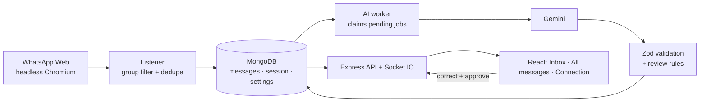

# WhatsApp Message Intelligence

Listens to **one WhatsApp group through WhatsApp Web**, stores every text and image message once, classifies each message with an LLM (Gemini), validates the result, and sends uncertain or high-impact messages to a review screen, where a person corrects and approves them.

No WhatsApp Business API is used. The app links to your account as a normal "Linked device", the same way web.whatsapp.com does.



## Quick start

Needs Node.js 20+, Docker, and a free Gemini API key from [aistudio.google.com](https://aistudio.google.com).

```bash
git clone https://github.com/karthikeyagullapudi/whatsapp-message-intelligence.git && cd whatsapp-message-intelligence
npm install                          # also downloads Chromium for whatsapp-web.js
cp .env.example .env                 # then set GEMINI_API_KEY in .env
npm run db:up                        # MongoDB 7 in Docker
npm run dev                          # API on :4000, UI on http://localhost:5173
```

Then:

1. **Connection:** scan the QR code with WhatsApp → Settings → Linked devices → Link a device. Wait until it says the session is saved (about 1 minute on the first login). After that, restarting the server does not ask for a QR again.
2. **Pick a group:** search for it in the group picker on the same page. From now on only that group is captured.
3. **Send messages** in the group. They appear on **All messages** within seconds, classified.
4. **Inbox:** Incidents, Change Requests, high-priority, low-confidence and invalid results wait in the **Inbox**. Correct the fields and approve (keyboard: J/K to move, 1–6 category, A approve, S skip, ? for all shortcuts, ⌘K command palette).

Other commands:

```bash
npm test          # 44 unit + integration tests (in-memory MongoDB, no WhatsApp or API key needed)
npm run eval      # runs 20 labelled messages through the real model and prints accuracy
npm run db:down   # stop MongoDB
VITE_MOCK=1 npm run dev -w client   # UI only, with 25 fixture messages; no server, WhatsApp or API key needed
```

## What it does

| Requirement | How |
| --- | --- |
| WhatsApp authentication | whatsapp-web.js drives WhatsApp Web in headless Chromium; the QR is streamed to the browser |
| Persistent session | `RemoteAuth` with a MongoDB GridFS session store; a restart restores the login without a QR |
| One group | The group is chosen in the UI and saved in `settings`; everything else is ignored |
| Message, sender, group, timestamp | Stored per message, plus the original payload (`raw`) and the image file |
| Duplicates | Unique index on `waMessageId` + atomic upsert (hard); same sender + same content within 10 min is marked `duplicateOf` and not re-classified (soft) |
| AI classification + extraction | Gemini with an enforced JSON schema: category, confidence, summary, priority, actionRequired, location/people/dates/resources, reasoning |
| Validation of the AI result | Zod schema + business rules; one repair retry with the exact errors; otherwise → human review |
| Review screen | Queue of `needs_review`, form pre-filled with the AI values, changed fields highlighted, AI answer kept next to the human one |
| Connection / processing failures | Reconnect with backoff, Chromium crash detection, backfill after reconnect, AI retries with backoff, `failed` state + Retry button, stale job recovery |

## Project layout

```text
server/src/
  app.js, server.js           Express app (no listen, used by tests) / boot + wiring
  config/                     zod-validated env, Mongo connect with retry, paths
  modules/
    whatsapp/                 client (connection manager), sessionStore, listener, mapper, service, routes
    messages/                 model, repository (all queries), media storage, service, routes
    ai/                       schema, prompt, provider (Gemini adapter), validator, worker
    review/                   review schema, service (approve + audit), routes
    settings/                 selected group, WhatsApp state, threshold
  realtime/socket.js          Socket.IO emit helper
  middleware/                 validate (express-validator + zod), errorHandler, notFound
server/tests/                 unit (mapper, validator, connection) + integration (dedupe, worker, review API)
server/eval/                  labelled dataset + accuracy script
client/src/                   pages (Inbox, All messages, Connection), components (ui, layout, message), hooks, api (+ mock), styles/tokens.css
docs/                         the documents below
```

Each module is split into **routes → controller → service → repository/model**. Routes map URLs, controllers translate HTTP, services hold the logic, and only the repository builds MongoDB queries. `server.js` creates every object and passes it in (dependency injection), so each part can be tested on its own with fakes.

## Documentation

- [Architecture](docs/ARCHITECTURE.md): components, data flow, message lifecycle, data model, API
- [WhatsApp integration](docs/WHATSAPP_INTEGRATION.md): why whatsapp-web.js, sessions, reconnects, dedupe, and the library issues found and worked around
- [AI approach and model choice](docs/AI_APPROACH.md): model comparison, schema, prompt, validation, review rules, eval results
- [Limitations and production risks](docs/LIMITATIONS_AND_RISKS.md)

## Configuration

All settings are in `.env` (see [.env.example](.env.example)) and are validated at startup; a bad value stops the server with a clear message.

| Variable | Default | Meaning |
| --- | --- | --- |
| `GEMINI_API_KEY` | (none) | Without it, messages are still captured and wait as `pending` |
| `AI_MODEL` | `gemini-3.5-flash-lite` | Any Gemini model that supports JSON-schema output |
| `CONFIDENCE_THRESHOLD` | `0.75` | Below this, a result goes to review |
| `AI_MAX_RPM` / `AI_CONCURRENCY` / `AI_MAX_ATTEMPTS` | `10` / `2` / `3` | Worker rate limit, parallel jobs, retries before `failed` |
| `WA_BACKFILL_LIMIT` | `50` | Messages fetched from the group after each reconnect |
| `WA_HEADLESS` | `true` | Set `false` to see the Chromium window while debugging |
