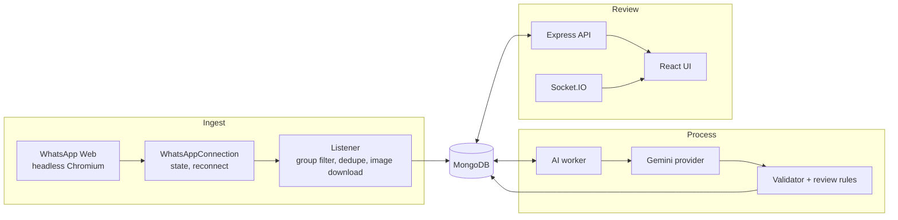
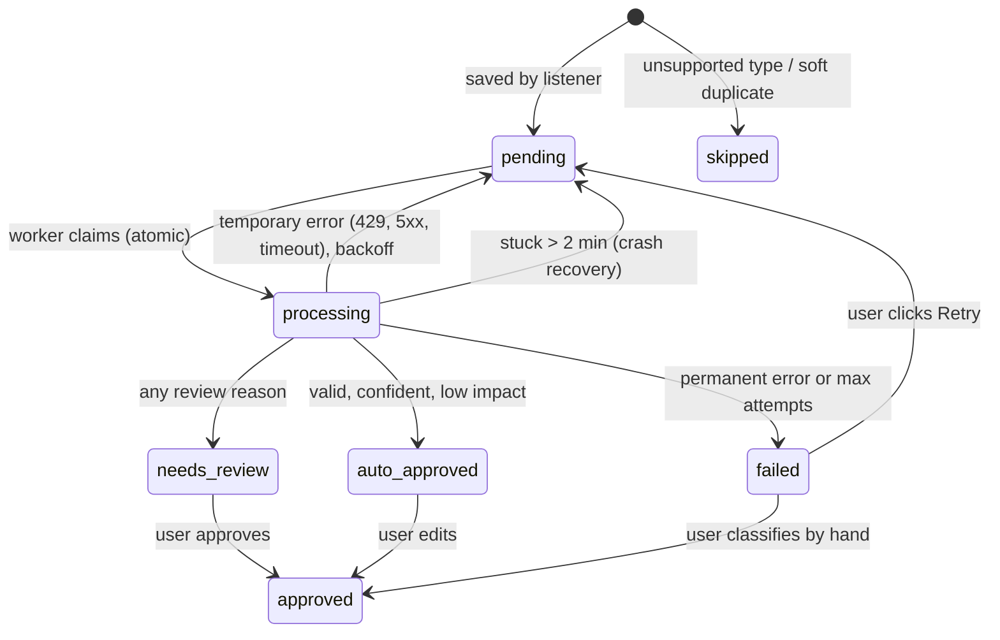

# Architecture

## Three separate responsibilities

| Part | Job | Never does |
| --- | --- | --- |
| **Ingest** (`modules/whatsapp`) | Keep the WhatsApp Web connection alive, filter the selected group, save each message once | Call the AI |
| **Process** (`modules/ai`) | Take saved messages from the queue, classify, validate, decide if a person must review | Talk to WhatsApp |
| **Review** (`modules/messages`, `modules/review`, `client`) | Show messages, let a person correct and approve | Change the original message or the AI's answer |

The listener only writes to MongoDB, so a slow, rate-limited or broken model can never cause a message to be lost: messages simply wait as `pending`.

For the demo, all three run in one Node process (`server.js`). They only share MongoDB, so they could run as separate processes without code changes.



## Message lifecycle

`processing.status` on each message is both its state and the job queue.



## Request flow for one message

1. `message_create` fires in whatsapp-web.js. `WhatsAppConnection` re-emits it only if it comes from the current client generation.
2. `listener.handle()` drops it unless it is from the selected group, then checks `waMessageId` (hard duplicate), maps it with the pure `whatsapp.mapper.js`, downloads an image to `storage/media/<sha256>.<ext>`, checks the 10-minute content hash (soft duplicate), and inserts it atomically.
3. The UI receives `message:new` over Socket.IO.
4. The AI worker (polling every 2 s, 2 slots, max 10 requests/min) claims the oldest due `pending` message with one `findOneAndUpdate`.
5. It builds the prompt (system prompt + 8 examples + message + image bytes), calls Gemini with the JSON schema, validates the output, repairs once if needed, and applies the review rules.
6. It saves `ai` and the new status, and the UI receives `message:updated`.
7. A reviewer sends `PATCH /api/messages/:id/review`. The `review` block is saved next to `ai` with `changedFields`, and the status becomes `approved`.

## Data model

One main collection, `messages`. The original message, the AI result and the human correction are separate sub-documents, so nothing is overwritten and AI accuracy can be measured later (`review.changedFields`).

```js
{
  waMessageId,            // "<chatId>_<WhatsApp message id>", unique
  groupId, groupName, senderId, senderName, fromMe,
  timestamp,              // when it was sent on WhatsApp
  type,                   // text | image | unsupported
  waType,                 // WhatsApp's own type (chat, image, video, ptt, …)
  body,                   // original text or caption, never edited
  media: { path, mimetype, size, sha256, error },
  raw,                    // trimmed original payload
  source,                 // live | backfill
  contentHash, duplicateOf,
  processing: { status, skipReason, attempts, lastError, lockedAt, nextRunAt },
  ai:     { category, confidence, summary, priority, actionRequired, entities, reasoning,
            model, provider, promptVersion, latencyMs, repaired, warnings,
            validationErrors, reviewReasons, rawOutput?, processedAt },
  review: { category, summary, priority, actionRequired, entities, notes,
            reviewedBy, reviewedAt, changedFields }
}
```

| Index | Used for |
| --- | --- |
| `{ waMessageId: 1 }` unique | Hard dedupe |
| `{ 'processing.status': 1, 'processing.nextRunAt': 1 }` | Worker claims the next due job |
| `{ groupId: 1, timestamp: -1 }` | Message list |
| `{ contentHash: 1, timestamp: -1 }` | Soft-duplicate lookup |

Other collections: `settings` (one document: selected group, last WhatsApp state, confidence threshold) and `whatsapp-RemoteAuth-main.files/chunks` (the zipped WhatsApp session in GridFS).

## API

All errors use one shape: `{ "error": { "code", "message", "details?" } }`. URL params and query filters are validated with **express-validator**. Structured bodies (the review) are validated with **zod** schemas that share their pieces with the AI schema.

| Method | Path | Does |
| --- | --- | --- |
| GET | `/api/health` | DB, WhatsApp state, AI worker status |
| GET | `/api/whatsapp/status` | Connection state, QR (data URL), account, selected group, last error, next retry |
| GET | `/api/whatsapp/groups` | Groups of the linked account |
| PUT | `/api/whatsapp/group` | Select the group to listen to (`{ groupId }`) |
| POST | `/api/whatsapp/logout` | Unlink the device, delete the stored session, show a new QR |
| GET | `/api/messages` | `groupId`, `status`, `category` (final: review over AI), `q`, `page`, `limit`, `sort`. The UI always passes the selected group, so after a logout or group change the previous group's messages are not shown (they stay in the database) |
| GET | `/api/messages/stats` | Count per status (optional `groupId`) |
| GET | `/api/messages/:id` | One message with AI and review data |
| GET | `/api/messages/:id/media` | The stored image |
| PATCH | `/api/messages/:id/review` | Save corrections and approve (400 invalid, 404 unknown, 409 not reviewable) |
| POST | `/api/messages/:id/retry` | Re-queue a failed message |

Socket.IO events (server → browser): `wa:state` (full connection status, including the QR), `message:new`, `message:updated`. A browser that connects late gets the current `wa:state` immediately.

## Key design decisions

- **MongoDB as the queue instead of Redis/BullMQ.** One group produces little traffic; one database means one `docker compose up`. `findOneAndUpdate` gives atomic claiming. BullMQ is the upgrade path (see limitations).
- **Dependency injection from `server.js`.** Every module receives its collaborators, so tests pass fakes (a fake WhatsApp client, a fake AI provider) instead of mocking imports.
- **`app.js` does not call `listen()`**, so supertest can drive the real app in tests.
- **Express 5** forwards rejected promises to the error handler, so controllers need no try/catch.
- **Optimistic state guards.** Every job and review update includes the expected current status in its filter, so the worker and a reviewer can never overwrite each other.
