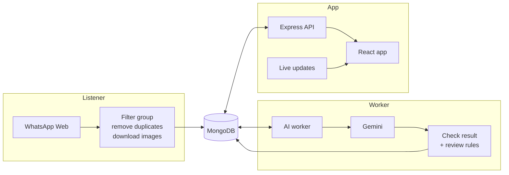
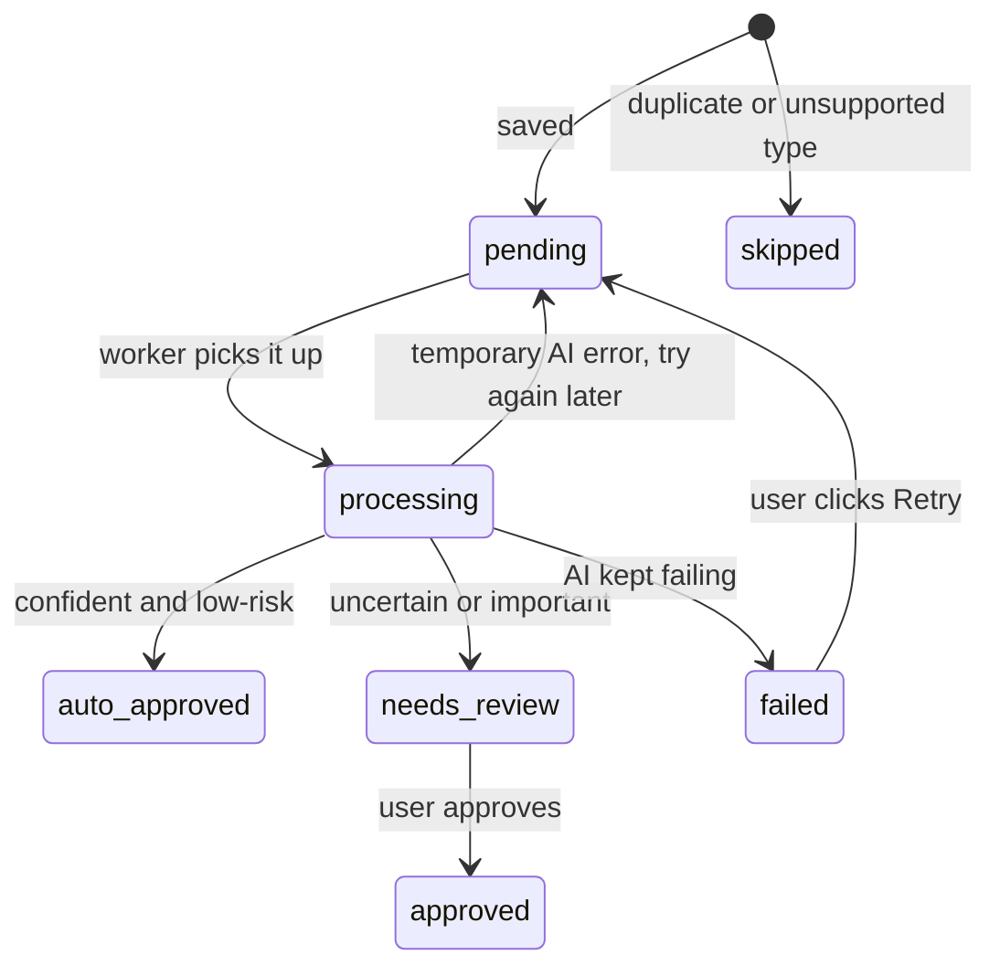

# Architecture

The system is split into three parts that each do one job. They never call each other directly; they only share the MongoDB database.

| Part | What it does | What it never does |
| --- | --- | --- |
| **WhatsApp listener** | Keeps the WhatsApp Web connection alive and saves every message from the selected group, once | Call the AI |
| **AI worker** | Picks up saved messages, classifies them with Gemini, checks the result, and decides if a person should review it | Talk to WhatsApp |
| **API and web app** | Shows the messages and lets a person correct and approve the AI's result | Change the original message or the AI's answer |

I split it this way mainly so that no message can be lost because of the AI. The listener only saves; if Gemini is slow, rate-limited or down, messages simply wait in the database until the worker catches up.

All three parts currently run in one Node.js process for simplicity. Because they only communicate through the database, they can be moved into separate services later without rewriting them.

## The journey of one message

1. Someone posts in the WhatsApp group.
2. The **listener** checks that it comes from the selected group and has not been saved before, downloads the image if there is one, and saves the message as **pending**.
3. The **AI worker** picks up the oldest pending message, sends it to Gemini with clear instructions, and checks the answer.
4. The result is saved. If the AI is confident and the message is low-risk, it is **auto-approved**. Otherwise it goes to **needs review**.
5. The web app updates immediately. A reviewer opens the Inbox, corrects anything that is wrong, and approves it.

Every message has a status that shows where it is:

## How data is stored

Each message is one document in MongoDB. It keeps three things **side by side**, so nothing is ever overwritten:

- **The original message:** text or caption, sender, group, time and image. Never edited.
- **The AI's answer:** category, summary, extracted details, confidence, and the reasons it needs review.
- **The human's correction:** the reviewer's final values and a list of which fields they changed.

Keeping the AI's answer and the human's answer separate means we can always see what the AI got wrong, and measure its accuracy over time.

The database also holds a small settings record (the selected group and connection status) and the saved WhatsApp login.

**Indexes** (to keep things fast and correct):

| Index | Purpose |
| --- | --- |
| Unique WhatsApp message id | Makes it impossible to store the same message twice |
| Status + next attempt time | Lets the worker find the next message quickly |
| Group + time | Fast message lists, newest first |
| Content fingerprint + time | Finds "same message posted again" quickly |

## API

The web app talks to the server through a small REST API. Every input is validated, and every error comes back in the same format: `{ "error": { "code", "message" } }`.

| Method | Path | Purpose |
| --- | --- | --- |
| GET | `/api/health` | Is the database, WhatsApp and the AI worker running? |
| GET | `/api/whatsapp/status` | Connection status, including the QR code when needed |
| GET | `/api/whatsapp/groups` | Groups the account belongs to |
| PUT | `/api/whatsapp/group` | Choose the group to listen to |
| POST | `/api/whatsapp/logout` | Unlink the account |
| GET | `/api/messages` | List messages, with filters (group, status, category, search) |
| GET | `/api/messages/stats` | Number of messages in each status |
| GET | `/api/messages/:id` | One message with its AI result and review |
| GET | `/api/messages/:id/media` | The message's image |
| PATCH | `/api/messages/:id/review` | Save a correction and approve |
| POST | `/api/messages/:id/retry` | Try a failed message again |

The web app also receives **live updates** (via Socket.IO) when the connection status changes, a new message arrives, or a message is updated. It only shows messages from the currently selected group. After a logout or a group change, older messages stay in the database but are hidden.

## Key design decisions

I used MongoDB as the job queue instead of adding Redis. One group produces very little traffic, and keeping a single database means the whole project starts with one `docker compose up`. The worker claims a message in a single database operation, so two workers can never pick up the same message. If volume grew, moving to a proper queue such as BullMQ would be the next step.

Inside the server, each layer has one job: routes map URLs, controllers deal with HTTP, services hold the business rules, and only the repository talks to the database. This keeps changes contained: changing how the Retry button behaves, for example, only touches one service file.

All the parts are created and connected in one file, `server.js`. That made testing much simpler: the tests pass in a fake WhatsApp client or a fake AI instead of the real ones.

Finally, every update checks the message's current status before writing. Without that, a reviewer approving a message at the same moment the AI worker finishes it could overwrite each other's work.
